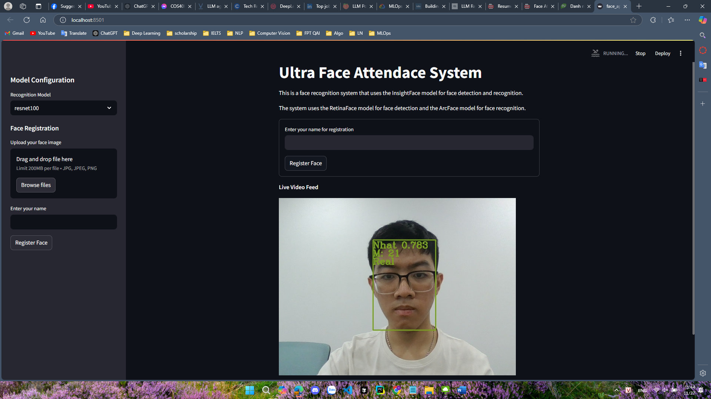

# Face Recognition Attendance System with Liveness Detection


## Demo



## Note

The code of this project is released under the MIT License. There is no limitation for both acadmic and commercial usage.

The training data containing the annotation (and the models trained with these data) are available for non-commercial research purposes only.

## Usage
Automatically downloads the onnx and prototxt files on the first run and put it to weights foler.
It is necessary to be connected to the Internet while downloading.

1. Install dependencies
``` bash
$ pip install -r requirements.txt
```

2. Running the application
```bash
$ streamlit run face_app.py
```

## Reference

- [RetinaFace in PyTorch](https://github.com/biubug6/Pytorch_Retinaface)
- [InsightFace: 2D and 3D Face Analysis Project](https://github.com/deepinsight/insightface)

## Framework

Pytorch

## Model Format

ONNX opset=11

## Netron

[retinaface_resnet.onnx.prototxt](https://netron.app/?url=https://storage.googleapis.com/ailia-models/insightface/retinaface_resnet.onnx.prototxt)
[arcface_r100_v1.onnx.prototxt](https://netron.app/?url=https://storage.googleapis.com/ailia-models/insightface/arcface_r100_v1.onnx.prototxt)
